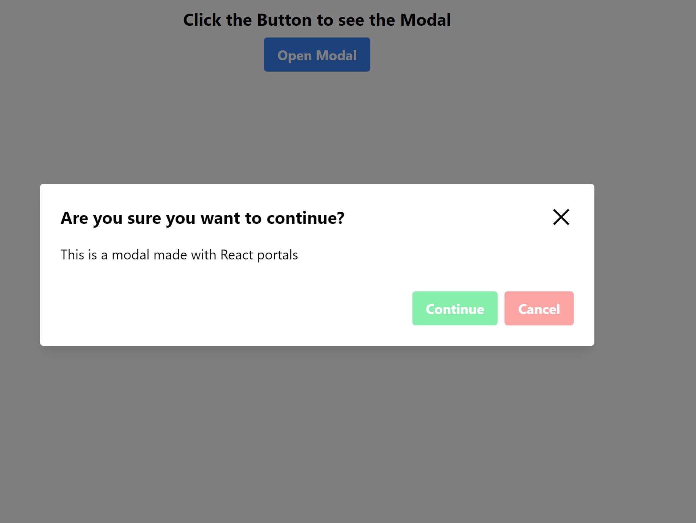

# Simple Modal with React Typescript

This is a simple responsive Modal created with React typescript

Please find the deployed site (here)[https://as-react-modal.netlify.app/]
## Prerequisites
Before you start with this task, research what is the correct way to implement a modal (it’s at the end of the HTML content, directly into the body), but I want you to figure out why exactly.

Also, research what **(Portal)[https://legacy.reactjs.org/docs/portals.html]** in React is and what problems does it solve.

## Requirements

1. Use the starter project, to kick-start your development.
2. Create a new repository and push the starter as initial commit.
3. Pick a styling solution of your choice. (CSS, SCSS, Modules, Tailwind, Styled components, Emotion)
Implement the UI.
4. You should be able to open the modal from a button, and close it via: Clicking a X button in the modal, Pressing ESCAPE, clicking outside of the modal.
5. Make sure you darken the background behind the modal.
6. Make sure the design is responsive
7. Add tests, no excuses

**Time limit**: 4 hours  

## Getting Started

### (Tailwind Installation)[https://tailwindcss.com/docs/guides/vite]

In terminal:
  npm install -D tailwindcss postcss autoprefixer
  npx tailwindcss init -p

Configure your template paths:  
in tailwind.config.js add:

  content: [
    "./index.html",
    "./src/**/*.{js,ts,jsx,tsx}",
  ],

 Add the Tailwind directives to your index.css
    @tailwind base;
    @tailwind components;
    @tailwind utilities; 

To automatically order classes:
      npm install -D prettier prettier-plugin-tailwindcss

In prettierrc add:
   "plugins": ["prettier-plugin-tailwindcss"]

## To install [React X Icon](React-icons.github.io/react-icons/):
    npm install react-icons --save
## Troubleshooting

While Creating portal encountered typescript error:
  *Argument of type '<T extends Node>(node: T) => T' is not assignable to parameter of type 'Element | DocumentFragment'.ts(2345)
(method) Document.getElementById(elementId: string): HTMLElement | null
Returns a reference to the first object with the specified value of the ID attribute.*

- Needed to check that portal exists first **Fixed with:**

const getPortal = document.getElementById('portal')

if(!getPortal) return null

and then returned portal in the modal components, see line 41 Modal.tsx

## Github setup

1. Create a local folder and connect it to [Github](https://github.com/)

In terminal Terminal type :

git init
git add .
git commit -m ‘First commit’

2. Open github and create new repository

Copy the link and in terminal add:

git remote add origin (paste the link to the Github repo here)
git push origin master

If needed Enter credentials to connect the IDE to Github

Resources found on [Youtube](https://www.youtube.com/watch?v=vbQ2bYHxxEA)

## Testing:

to simulate clicks and user event installed UserEvent:
    npm install --save-dev @testing-library/user-event

## Resources:
(Accessible Modal with Portals)[https://assortment.io/posts/accessible-modal-component-react-portals-part-1]

(Automatic Class Sorting)[https://tailwindcss.com/blog/automatic-class-sorting-with-prettier]

(Modal Testing)[https://dev.to/mihomihouk/test-a-portal-element-in-a-react-app-152h]