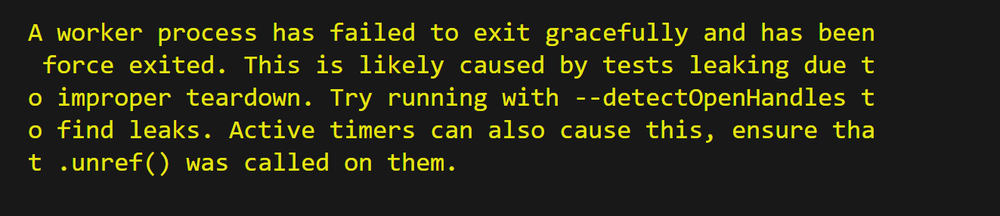

# Simple Modal with React Typescript

This is a simple responsive Modal created with React Typescript. It supports multiple closing actions and is rendered via a React Portal to ensure proper layering in the DOM.


Please find the deployed site [here](https://as-modal.netlify.app/) and my Github Repo [here](https://github.com/aimansae/as-modal?tab=readme-ov-file)

## Table of Contents

- [Prerequisites](#prerequisites)
- [Requirements](#requirements)
- [Features](#features)
- [Technologies Used](#technologies-used)
- [Challenges ](#challenges)
- [Getting Started](#getting-started)
- [GitHub Setup](#github-setup)
- [Troubleshooting](#troubleshooting)
- [Testing](#testing)
- [Resources](#resources)


## Prerequisites
This is challenge from my mentor Amal

*Before you start with this task, research what is the correct way to implement a modal (it’s at the end of the HTML content, directly into the body), but I want you to figure out why exactly.

Also, research what **[Portal](https://legacy.reactjs.org/docs/portals.html)** in React is and what problems does it solve.*

## Requirements

1. Use the starter project, to kick-start your development.
2. Create a new repository and push the starter as initial commit.
3. Pick a styling solution of your choice. (CSS, SCSS, Modules, Tailwind, Styled components, Emotion)
Implement the UI.
4. You should be able to open the modal from a button, and close it via: Clicking a X button in the modal, Pressing ESCAPE, clicking outside of the modal.
5. Make sure you darken the background behind the modal.
6. Make sure the design is responsive
7. Add tests, no excuses


## Features
- Open modal via button click
= Close modal via:
X button, ESC key, Click outside (overlay)
- Dimmed background overlay
- Responsive design
- Built with accessibility in mind using React Portal
- Unit tested with React Testing Library and Jest

**Time limit**: 4 hours  

## Technologies Used

 - [React](https://reactjs.org/) - JavaScript library for building user interfaces 
 - [TypeScript](https://www.typescriptlang.org/) - Adds static typing to JavaScript 
 - [Tailwind CSS](https://tailwindcss.com/docs) - Utility-first CSS framework for styling 
 - [React Portals](https://legacy.reactjs.org/docs/portals.html) - Enables rendering components outside the DOM hierarchy 
 - [React Icons](https://react-icons.github.io/react-icons/) - Icon library with popular icon sets 
 - [Vite](https://vitejs.dev/) - Lightning-fast frontend tooling 
 - [Jest](https://jestjs.io/docs/getting-started) - Testing framework for JavaScript 
 - [React Testing Library](https://testing-library.com/docs/react-testing-library/intro/) - For testing React UI components 
 - [User Event](https://testing-library.com/docs/user-event/intro/) - Simulates real user interactions in tests

## Challenges
While working on this modal project, I came across a few challenges that pushed me to better understand how React and the browser work together, especially around Portals, React Refs, and event handling.

- After some research, I realized that placing the modal directly inside the main component tree can lead to layout and layering issues — especially when dealing with z-index. Portals solve this by rendering the modal directly into the <body>, which ensures it appears above all other content, regardless of its position in the component hierarchy.

- I also faced a TypeScript error when trying to mount the Portal. The issue was that document.getElementById('portal') could return null if the DOM element wasn’t loaded yet. I fixed it by checking if the portal element exists before rendering:
```bash 

const portalRoot = document.getElementById('portal');
if (!portalRoot) return null;

```
- Handling Clicks Outside the Modal
One of the key features was closing the modal when clicking outside of it. To do this, I used a ref to the modal content. At first, working with ref.current felt confusing, but I learned that it's just a reference to the actual DOM node. Using it, I could check if the clicked element was outside the modal:

```bash 
if (modalRef.current && !modalRef.current.contains(event.target)) {
  onClose();
}
This made it possible to close the modal only when the user clicks outside of it.
```

- Building the Overlay
Creating the dark overlay behind the modal was trickier than expected. I needed to make sure it covered the entire screen and sat behind the modal, but above everything else. That meant using position: fixed, full width/height, and a lower z-index than the modal itself. The overlay also doubles as a background that listens for clicks to close the modal, adding both visual and functional value.

## Getting Started

1. [Tailwind Installation](https://tailwindcss.com/docs/guides/vite)

In terminal:

```bash
  npm install -D tailwindcss postcss autoprefixer
  npx tailwindcss init -p
```
Configure your template paths:  
in tailwind.config.js add:

```bash
  content: [
    "./index.html",
    "./src/**/*.{js,ts,jsx,tsx}",
  ],

 Add the Tailwind directives to your index.css

    @tailwind base;
    @tailwind components;
    @tailwind utilities; 


To automatically order classes:

      npm install -D prettier prettier-plugin-tailwindcss

In prettierrc add:

   "plugins": ["prettier-plugin-tailwindcss"]
```
2. Install React [Icons](React-icons.github.io/react-icons/)

    npm install react-icons --save

## Github setup

1. Create a local folder and connect it to [Github](https://github.com/)

In terminal Terminal type :

git init
git add .
git commit -m ‘First commit’

2. Open github and create new repository

Copy the link and in terminal add:

git remote add origin (paste the link to the Github repo here)
git push origin master

If needed Enter credentials to connect the IDE to Github

Resources found on [Youtube](https://www.youtube.com/watch?v=vbQ2bYHxxEA)

## Troubleshooting

- While Creating portal encountered typescript error:
  *Argument of type '<T extends Node>(node: T) => T' is not assignable to parameter of type 'Element | DocumentFragment'.ts(2345)
(method) Document.getElementById(elementId: string): HTMLElement | null
Returns a reference to the first object with the specified value of the ID attribute.*

- Needed to check that portal exists first **Fixed with:**

const getPortal = document.getElementById('portal')

if(!getPortal) return null

and then returned portal in the modal components, see line 41 Modal.tsx

- While running tests, encountered the following error:



Fixed by adding to script, test in package.json
  --watchAll --detectOpenHandles

## Testing: Used [Jest](https://nextjs.org/docs/app/guides/testing/jest) for testing


 
```bash

npx create-next-app@latest --example with-jest with-jest-app

To set up Jest, install jest and the following packages as dev dependencies:
npm install -D jest jest-environment-jsdom @testing-library/react @testing-library/dom @testing-library/jest-dom ts-node @types/jest

Generate a basic Jest configuration file by running the following command:
npm init jest@latest

To simulate clicks and user event installed UserEvent:

npm install --save-dev @testing-library/user-event

To run tests:
npm run test
```


## Resources:

- [Accessible Modal with Portals](https://assortment.io/posts/accessible-modal-component-react-portals-part-1)

- [Automatic Class Sorting](https://tailwindcss.com/blog/automatic-class-sorting-with-prettier)

- [Modal Testing](https://dev.to/mihomihouk/test-a-portal-element-in-a-react-app-152h)